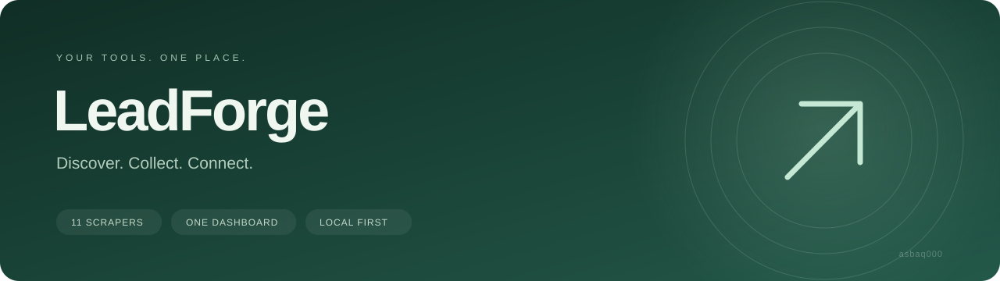

<div align="center">



**A thoughtfully organized scraper collection with one local control room.**

[Quick start](#quick-start) · [The collection](#the-collection) · [Configuration](#make-it-your-own) · [Development](#development)


</div>

---

LeadForge brings your platform scrapers into a clean, responsive workspace. Configure a search, launch an engine, and follow its live output without jumping between folders and terminals.

Every scraper keeps its own code, dependencies, documentation, authentication, and results. The dashboard connects them through a small, editable registry.

## Why LeadForge

| A shared workspace | Independent engines |
| --- | --- |
| Searchable platform library | Separate folders and setup guides |
| Editable inputs and configuration files | Existing CLI options stay available |
| Live logs, stop controls, and log downloads | Results remain with the selected scraper |
| Responsive interface | Runs stay on your machine |
| No npm dependencies | Python environments stay isolated |

## Quick start

**Prerequisites:** Node.js 20+ and Python 3.10+.

```sh
npm start
```

Open **http://127.0.0.1:3000**. The dashboard starts without installing npm packages.

Before running a scraper, open its README and install its Python dependencies. A typical setup, from inside the chosen platform folder:

```sh
python -m venv .venv
# Windows PowerShell: .venv\Scripts\Activate.ps1
# macOS / Linux: source .venv/bin/activate
python -m pip install -r requirements.txt
```

Some engines use `pyproject.toml` or only the standard library; their READMEs give the appropriate command. Playwright engines also need `python -m playwright install chromium`.

The dashboard uses the selected engine's `.venv` automatically. Otherwise it uses `LEADFORGE_PYTHON` or `python` on your PATH.

<details>
<summary><strong>Choose a Python executable or dashboard port</strong></summary>

```powershell
$env:LEADFORGE_PYTHON = 'C:\path\to\python.exe'
$env:PORT = '3000'
npm start
```

Each scraper can also set `LEADFORGE_PYTHON` in its own ignored `.env` file. A local `.venv` takes priority.

</details>

## The collection

| Platform | Engine | Setup |
| --- | --- | --- |
| Instagram | Discover creators by keywords and profile filters | [Guide](Instagram/README.md) |
| Instagram · Alternative | Creator niches, audience filters, and pacing | [Guide](Instagram/Alternative/README.md) |
| LinkedIn | Hiring posts and configurable qualification rules | [Guide](LinkedIn/README.md) |
| Facebook | Posts from curated groups | [Guide](Facebook/README.md) |
| Google Maps | Local businesses by city and category | [Guide](GoogleMaps/README.md) |
| Reddit | Community searches, queries, and scoring vocabulary | [Guide](Reddit/README.md) |
| Threads | Conversation leads and score filters | [Guide](Threads/README.md) |
| Twitter / X | Post discovery, freshness, and location filters | [Guide](Twitter/README.md) |
| Upwork | Jobs by keywords, niches, and client filters | [Guide](Upwork/README.md) |
| YouTube | Channels from search seeds and audience filters | [Guide](YouTube/README.md) |
| YouTube Podcasts | Podcast discovery and qualification | [Guide](YouTubePodcasts/README.md) |

Original detailed guides are retained as `LEGACY_GUIDE.md` where available. Both Instagram engines are preserved separately.

## Make it your own

1. **Choose a platform.** Open its card and read the setup guide.
2. **Shape the search.** Fill in inputs or edit its allowlisted configuration files.
3. **Run and follow along.** Inspect live output, stop a run, or download its log.

Use **Additional arguments** for supported CLI options. Values are a JSON array, passed directly to Python without a shell:

```json
["--hours", "24", "--format", "csv"]
```

Blank optional fields use engine defaults. Configuration changes apply to the next run. LinkedIn, Facebook, and Reddit expose existing tunables through `dashboard.config.json`; other engines use YAML, keywords, seeds, or niche files.

### Add or extend an engine

Edit [scrapers.json](scrapers.json) to define its folder, entry command, input fields, and editable configuration files. The frontend generates its library and forms from that registry.

```text
LeadForge/
├── dashboard/             Local server and shared interface
├── docs/assets/           README visuals
├── Instagram/             Primary engine + Alternative/
├── LinkedIn/              Platform code and documentation
├── ...                    Other platform folders
├── scrapers.json          Engine registry
└── package.json           Dashboard commands
```

## Credentials and results

Place credentials in the platform's ignored `.env` file, or a root `.env` for shared values. The dashboard passes these to the selected process; shell environment variables take precedence. Supply your own Google credentials where required and complete browser login before running authenticated engines.

Outputs are managed by each scraper and written relative to its folder or to its configured Google Sheet. The dashboard displays process logs rather than a combined results database. History stays in memory and resets with the server. One run per engine and up to four simultaneous runs are supported.

Secrets, browser profiles, environments, databases, logs, snapshots, and generated lead files are excluded from Git. Avoid putting secrets in CLI arguments, which appear in run history. Replace previously embedded keys before publishing your own copy.

## Scope

Searches are configurable within each engine's implemented capabilities. Some inherited classifiers remain specialized, such as hiring intent or podcast detection. Arbitrary natural-language requests do not create new scraping behavior.

Live runs require the selected platform's dependencies, credentials, and access. Browser challenges and login need your interaction. Programs requiring terminal input should be set up in a terminal first.

## Development

```sh
npm test
```

Checks cover registry entry points, configuration files, argument handling, path isolation, local API access, and credential-file protection. Live platform scraping is not covered by these checks.

---

<div align="center"><sub>LeadForge · crafted by <a href="https://github.com/asbaq000">asbaq000</a></sub></div>
